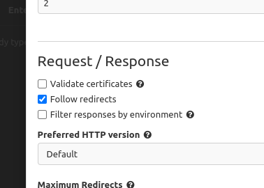

# Log API<!-- omit from toc -->

Api REST usando java e Spring Boot, feita durante workshop MSR da algaworks. Alem disso, possui a documentaçao usando
OpenAPI 3.0 e requisições HTTPS.

## Tabela de conteúdos<!-- omit from toc -->

- [Features](#features)
- [Contrato da API](#contrato-da-api)
- [Endpoints da Aplicação](#endpoints-da-aplicação)
  - [/entregas/ {entregaId}/finalizacao](#entregas-entregaidfinalizacao)
    - [PUT](#put)
      - [Resumo:](#resumo)
      - [Descrição:](#descrição)
      - [Parametros](#parametros)
      - [Respostas](#respostas)
  - [/clientes/ {clienteId}](#clientes-clienteid)
    - [GET](#get)
      - [Resumo:](#resumo-1)
      - [Descrição:](#descrição-1)
      - [Parametros](#parametros-1)
      - [Respostas](#respostas-1)
    - [PUT](#put-1)
      - [Resumo:](#resumo-2)
      - [Descrição:](#descrição-2)
      - [Parametros](#parametros-2)
      - [Respostas](#respostas-2)
    - [DELETE](#delete)
      - [Resumo:](#resumo-3)
      - [Descrição:](#descrição-3)
      - [Parametros](#parametros-3)
      - [Respostas](#respostas-3)
  - [/entregas](#entregas)
    - [GET](#get-1)
      - [Resumo:](#resumo-4)
      - [Descrição:](#descrição-4)
      - [Respostas](#respostas-4)
    - [POST](#post)
      - [Resumo:](#resumo-5)
      - [Descrição:](#descrição-5)
      - [Respostas](#respostas-5)
  - [/entregas/ {entregaId}/ocorrencias](#entregas-entregaidocorrencias)
    - [GET](#get-2)
      - [Resumo:](#resumo-6)
      - [Descrição:](#descrição-6)
      - [Parametros](#parametros-4)
      - [Respostas](#respostas-6)
    - [POST](#post-1)
      - [Resumo:](#resumo-7)
      - [Descrição:](#descrição-7)
      - [Parametros](#parametros-5)
      - [Respostas](#respostas-7)
  - [/clientes](#clientes)
    - [GET](#get-3)
      - [Resumo:](#resumo-8)
      - [Descrição:](#descrição-8)
      - [Respostas](#respostas-8)
    - [POST](#post-2)
      - [Resumo:](#resumo-9)
      - [Descrição:](#descrição-9)
      - [Respostas](#respostas-9)
  - [/entregas/ {entregaId}](#entregas-entregaid)
    - [GET](#get-4)
      - [Resumo:](#resumo-10)
      - [Descrição:](#descrição-10)
      - [Parametros](#parametros-6)
      - [Respostas](#respostas-10)
- [Pré-requisitos e como rodar a aplicação/testes](#pré-requisitos-e-como-rodar-a-aplicaçãotestes)
- [Tecnologias utilizadas](#tecnologias-utilizadas)
  - [Dependencias](#dependencias)
  - [Licença](#licença)
  - [Autor](#autor)

## Features

- [X]  CRUD completo de clientes e entregas
- [X]  Listagem e registro de ocorrências a partir de uma entrega

## Contrato da API

```yaml
openapi: 3.0.1
info:
  title: Log Api
  Descrição: Aplicação desenvolvida para testes.
  contact:
    Nome: gasfgrv
    url: https://github.com/gasfgrv
    email: gustavo_almeida11@hotmail.com
  license:
    Nome: Apache License Version 2.0
    url: https://www.apache.org/licenses/LICENSE-2.0
  version: v1
servers:
  - url: https://localhost:8443/
    Descrição: Generated server url
tags:
  - Nome: Ocorrências
    Descrição: Endpoint para tratamento de Ocorrências relacionadas a uma entrega
  - Nome: Clientes
    Descrição: Endpoint para manipulação dos dados de um cliente
  - Nome: Entregas
    Descrição: Endpoint para tratamento das entregas
paths:
  /entregas/{entregaId}/finalizacao:
    put:
      tags:
        - Entregas
      Resumo: Finalizar entrega
      Descrição: Finalizar uma determinada entregas a partir do id
      operationId: finalizar
      Parametros:
        - Nome: entregaId
          in: path
          Descrição: Id da entrega
          Obrigatório: true
          schema:
            type: integer
            format: int64
      Respostas:
        '200':
          Descrição: Entrega finalizada
        '204':
          Descrição: No Content
        '400':
          Descrição: Bad Request
          content:
            application/json:
              schema:
                $ref: '#/components/schemas/Problema'
        '404':
          Descrição: Not Found
          content:
            application/json:
              schema:
                $ref: '#/components/schemas/Problema'
  /clientes/{clienteId}:
    get:
      tags:
        - Clientes
      Resumo: Buscar cliente
      Descrição: Buscar determinado cliente a partir do id
      operationId: buscar_1
      Parametros:
        - Nome: clienteId
          in: path
          Descrição: Id do cliente
          Obrigatório: true
          schema:
            type: integer
            format: int64
      Respostas:
        '200':
          Descrição: Cliente encontrado
          content:
            application/json:
              schema:
                $ref: '#/components/schemas/Cliente'
        '400':
          Descrição: Bad Request
          content:
            application/json:
              schema:
                $ref: '#/components/schemas/Problema'
        '404':
          Descrição: Cliente não encontrado
          content:
            application/json: { }
    put:
      tags:
        - Clientes
      Resumo: Atualizar cliente
      Descrição: Atualizar dados do cliente
      operationId: atualizar
      Parametros:
        - Nome: clienteId
          in: path
          Descrição: Id do cliente
          Obrigatório: true
          schema:
            type: integer
            format: int64
      requestBody:
        Descrição: Formulário de atualização
        content:
          application/json:
            schema:
              $ref: '#/components/schemas/ClienteInput'
        Obrigatório: true
      Respostas:
        '200':
          Descrição: Cliente atualizado
          content:
            application/json:
              schema:
                $ref: '#/components/schemas/ClienteModel'
        '400':
          Descrição: Bad Request
          content:
            application/json:
              schema:
                $ref: '#/components/schemas/Problema'
        '404':
          Descrição: Not Found
          content:
            application/json:
              schema:
                $ref: '#/components/schemas/Problema'
    delete:
      tags:
        - Clientes
      Resumo: Deletar cliente
      Descrição: Deletar dados do cliente
      operationId: remover
      Parametros:
        - Nome: clienteId
          in: path
          Descrição: Id do cliente
          Obrigatório: true
          schema:
            type: integer
            format: int64
      Respostas:
        '204':
          Descrição: Cliente apagado
          content:
            application/json: { }
        '400':
          Descrição: Bad Request
          content:
            application/json:
              schema:
                $ref: '#/components/schemas/Problema'
        '404':
          Descrição: Not Found
          content:
            application/json:
              schema:
                $ref: '#/components/schemas/Problema'
  /entregas:
    get:
      tags:
        - Entregas
      Resumo: Listar entregas
      Descrição: Listar todas as entregas salvas
      operationId: listar
      Respostas:
        '200':
          Descrição: Todas as entregas
          content:
            application/json:
              schema:
                $ref: '#/components/schemas/EntregaModel'
        '400':
          Descrição: Bad Request
          content:
            application/json:
              schema:
                $ref: '#/components/schemas/Problema'
        '404':
          Descrição: Not Found
          content:
            application/json:
              schema:
                $ref: '#/components/schemas/Problema'
    post:
      tags:
        - Entregas
      Resumo: Solicitar entrega
      Descrição: Vincula um clienate à entrega e cria a mesma
      operationId: solicitar
      requestBody:
        Descrição: Formulário de cadastro
        content:
          application/json:
            schema:
              $ref: '#/components/schemas/EntregaInput'
        Obrigatório: true
      Respostas:
        '201':
          Descrição: Entrega solicitada
          content:
            application/json:
              schema:
                $ref: '#/components/schemas/EntregaModel'
        '400':
          Descrição: Bad Request
          content:
            application/json:
              schema:
                $ref: '#/components/schemas/Problema'
        '404':
          Descrição: Not Found
          content:
            application/json:
              schema:
                $ref: '#/components/schemas/Problema'
  /entregas/{entregaId}/ocorrencias:
    get:
      tags:
        - Ocorrências
      Resumo: Listar ocorrências
      Descrição: Listar todas as ocorrências relacionadas a uma entrega
      operationId: listar_1
      Parametros:
        - Nome: entregaId
          in: path
          Descrição: Id da entrega
          Obrigatório: true
          schema:
            type: integer
            format: int64
      Respostas:
        '200':
          Descrição: Todos as ocorrências
          content:
            application/json:
              schema:
                $ref: '#/components/schemas/OcorrenciaModel'
        '400':
          Descrição: Bad Request
          content:
            application/json:
              schema:
                $ref: '#/components/schemas/Problema'
        '404':
          Descrição: Not Found
          content:
            application/json:
              schema:
                $ref: '#/components/schemas/Problema'
    post:
      tags:
        - Ocorrências
      Resumo: Registrar ocorrencias
      Descrição: Vincula uma ocorrência a uma entrega
      operationId: registrar
      Parametros:
        - Nome: entregaId
          in: path
          Descrição: Id da entrega
          Obrigatório: true
          schema:
            type: integer
            format: int64
      requestBody:
        Descrição: dados da ocorrência
        content:
          application/json:
            schema:
              $ref: '#/components/schemas/OcorrenciaInput'
        Obrigatório: true
      Respostas:
        '201':
          Descrição: Ocorrência registrada
          content:
            application/json:
              schema:
                $ref: '#/components/schemas/OcorrenciaModel'
        '400':
          Descrição: Bad Request
          content:
            application/json:
              schema:
                $ref: '#/components/schemas/Problema'
        '404':
          Descrição: Not Found
          content:
            application/json:
              schema:
                $ref: '#/components/schemas/Problema'
  /clientes:
    get:
      tags:
        - Clientes
      Resumo: Listar clientes
      Descrição: Listar todos os clientes salvos
      operationId: listar_2
      Respostas:
        '200':
          Descrição: Todos os clientes
          content:
            application/json:
              schema:
                $ref: '#/components/schemas/ClienteResumoModel'
        '400':
          Descrição: Bad Request
          content:
            application/json:
              schema:
                $ref: '#/components/schemas/Problema'
        '404':
          Descrição: Not Found
          content:
            application/json:
              schema:
                $ref: '#/components/schemas/Problema'
    post:
      tags:
        - Clientes
      Resumo: Salvar cliente
      Descrição: Salvar cliente na base
      operationId: adicionar
      requestBody:
        Descrição: Formulário de cadastro
        content:
          application/json:
            schema:
              $ref: '#/components/schemas/ClienteInput'
        Obrigatório: true
      Respostas:
        '201':
          Descrição: Cliente Salvo
          content:
            application/json:
              schema:
                $ref: '#/components/schemas/Cliente'
        '400':
          Descrição: Bad Request
          content:
            application/json:
              schema:
                $ref: '#/components/schemas/Problema'
        '404':
          Descrição: Not Found
          content:
            application/json:
              schema:
                $ref: '#/components/schemas/Problema'
  /entregas/{entregaId}:
    get:
      tags:
        - Entregas
      Resumo: Buscar entrega
      Descrição: Buscar determinada entrega a partir do id
      operationId: buscar
      Parametros:
        - Nome: entregaId
          in: path
          Descrição: Id da entrega
          Obrigatório: true
          schema:
            type: integer
            format: int64
      Respostas:
        '200':
          Descrição: Entrega encontrada
          content:
            application/json:
              schema:
                $ref: '#/components/schemas/EntregaModel'
        '400':
          Descrição: Bad Request
          content:
            application/json:
              schema:
                $ref: '#/components/schemas/Problema'
        '404':
          Descrição: Entrega não encontrada
          content:
            application/json: { }
components:
  schemas:
    Campo:
      type: object
      properties:
        nome:
          type: string
        mensagem:
          type: string
    Problema:
      type: object
      properties:
        status:
          type: integer
          format: int32
        dataHora:
          type: string
          format: date-time
        titulo:
          type: string
        campos:
          type: array
          items:
            $ref: '#/components/schemas/Campo'
    ClienteInput:
      Obrigatório:
        - email
        - nome
        - telefone
      type: object
      properties:
        id:
          type: integer
          format: int64
        nome:
          maxLength: 60
          minLength: 0
          type: string
        email:
          maxLength: 255
          minLength: 0
          type: string
        telefone:
          maxLength: 20
          minLength: 0
          type: string
    ClienteModel:
      type: object
      properties:
        nome:
          type: string
        email:
          type: string
        telefone:
          type: string
    ClienteIdInput:
      type: object
      properties:
        id:
          type: integer
          format: int64
    DestinatarioInput:
      Obrigatório:
        - bairro
        - complemento
        - logradouro
        - nome
        - numero
      type: object
      properties:
        nome:
          type: string
        logradouro:
          type: string
        numero:
          type: string
        complemento:
          type: string
        bairro:
          type: string
    EntregaInput:
      Obrigatório:
        - cliente
        - destinatario
        - taxa
      type: object
      properties:
        cliente:
          $ref: '#/components/schemas/ClienteIdInput'
        destinatario:
          $ref: '#/components/schemas/DestinatarioInput'
        taxa:
          type: number
    ClienteResumoModel:
      type: object
      properties:
        id:
          type: integer
          format: int64
        nome:
          type: string
    DestinatarioModel:
      type: object
      properties:
        nome:
          type: string
        logradouro:
          type: string
        numero:
          type: string
        complemento:
          type: string
        bairro:
          type: string
    EntregaModel:
      type: object
      properties:
        id:
          type: integer
          format: int64
        cliente:
          $ref: '#/components/schemas/ClienteResumoModel'
        destinatario:
          $ref: '#/components/schemas/DestinatarioModel'
        taxa:
          type: number
        status:
          type: string
          enum:
            - PENDENTE
            - FINALIZADA
            - CANCELADA
        dataPedido:
          type: string
          format: date-time
        dataFinalizacao:
          type: string
          format: date-time
    OcorrenciaInput:
      Obrigatório:
        - descricao
      type: object
      properties:
        descricao:
          type: string
    OcorrenciaModel:
      type: object
      properties:
        id:
          type: integer
          format: int64
        descricao:
          type: string
        dataRegistro:
          type: string
          format: date-time
    Cliente:
      type: object
      properties:
        id:
          type: integer
          format: int64
        nome:
          type: string
        email:
          type: string
        telefone:
          type: string
```

## Endpoints da Aplicação

### /entregas/ {entregaId}/finalizacao

#### PUT

##### Resumo:

Finalizar entrega

##### Descrição:

Finalizar uma determinada entregas a partir do id

##### Parametros


| Nome      | Em   | Descrição     | Obrigatório | Schema |
| --------- | ---- | ------------- | ----------- | ------ |
| entregaId | path | Id da entrega | Sim         | long   |

##### Respostas


| Código | Descrição          |
| ------ | ------------------ |
| 200    | Entrega finalizada |
| 204    | No Content         |
| 400    | Bad Request        |
| 404    | Not Found          |

### /clientes/ {clienteId}

#### GET

##### Resumo:

Buscar cliente

##### Descrição:

Buscar determinado cliente a partir do id

##### Parametros


| Nome      | Em   | Descrição     | Obrigatório | Schema |
| --------- | ---- | ------------- | ----------- | ------ |
| clienteId | path | Id do cliente | Sim         | long   |

##### Respostas


| Código | Descrição              |
| ------ | ---------------------- |
| 200    | Cliente encontrado     |
| 400    | Bad Request            |
| 404    | Cliente não encontrado |

#### PUT

##### Resumo:

Atualizar cliente

##### Descrição:

Atualizar dados do cliente

##### Parametros


| Nome      | Em   | Descrição     | Obrigatório | Schema |
| --------- | ---- | ------------- | ----------- | ------ |
| clienteId | path | Id do cliente | Sim         | long   |

##### Respostas


| Código | Descrição         |
| ------ | ----------------- |
| 200    | Client atualizado |
| 400    | Bad Request       |
| 404    | Not Found         |

#### DELETE

##### Resumo:

Deletar cliente

##### Descrição:

Deletar dados do cliente

##### Parametros


| Nome      | Em   | Descrição     | Obrigatório | Schema |
| --------- | ---- | ------------- | ----------- | ------ |
| clienteId | path | Id do cliente | Sim         | long   |

##### Respostas


| Código | Descrição       |
| ------ | --------------- |
| 204    | Cliente apagado |
| 400    | Bad Request     |
| 404    | Not Found       |

### /entregas

#### GET

##### Resumo:

Listar entregas

##### Descrição:

Listar todas as entregas salvas

##### Respostas


| Código | Descrição         |
| ------ | ----------------- |
| 200    | Todas as entregas |
| 400    | Bad Request       |
| 404    | Not Found         |

#### POST

##### Resumo:

Solicitar entrega

##### Descrição:

Vincula um clienate à entrega e cria a mesma

##### Respostas


| Código | Descrição          |
| ------ | ------------------ |
| 201    | Entrega solicitada |
| 400    | Bad Request        |
| 404    | Not Found          |

### /entregas/ {entregaId}/ocorrencias

#### GET

##### Resumo:

Listar ocorrências

##### Descrição:

Listar todas as ocorrências relacionadas a uma entrega

##### Parametros


| Nome      | Em   | Descrição     | Obrigatório | Schema |
| --------- | ---- | ------------- | ----------- | ------ |
| entregaId | path | Id da entrega | Sim         | long   |

##### Respostas


| Código | Descrição            |
| ------ | -------------------- |
| 200    | Todos as ocorrências |
| 400    | Bad Request          |
| 404    | Not Found            |

#### POST

##### Resumo:

Registrar ocorrencias

##### Descrição:

Vincula uma ocorrência a uma entrega

##### Parametros


| Nome      | Em   | Descrição     | Obrigatório | Schema |
| --------- | ---- | ------------- | ----------- | ------ |
| entregaId | path | Id da entrega | Sim         | long   |

##### Respostas


| Código | Descrição             |
| ------ | --------------------- |
| 201    | Ocorrência registrada |
| 400    | Bad Request           |
| 404    | Not Found             |

### /clientes

#### GET

##### Resumo:

Listar clientes

##### Descrição:

Listar todos os clientes salvos

##### Respostas


| Código | Descrição         |
| ------ | ----------------- |
| 200    | Todos os clientes |
| 400    | Bad Request       |
| 404    | Not Found         |

#### POST

##### Resumo:

Salvar cliente

##### Descrição:

Salvar cliente na base

##### Respostas


| Código | Descrição     |
| ------ | ------------- |
| 201    | Cliente Salvo |
| 400    | Bad Request   |
| 404    | Not Found     |

### /entregas/ {entregaId}

#### GET

##### Resumo:

Buscar entrega

##### Descrição:

Buscar determinada entrega a partir do id

##### Parametros


| Nome      | Em   | Descrição     | Obrigatório | Schema |
| --------- | ---- | ------------- | ----------- | ------ |
| entregaId | path | Id da entrega | Sim         | long   |

##### Respostas


| Código | Descrição              |
| ------ | ---------------------- |
| 200    | Entrega encontrada     |
| 400    | Bad Request            |
| 404    | Entrega não encontrada |

Coleção para testar os endpoints da aplicação

[](https://insomnia.rest/run/?label=log-api&uri=https%3A%2F%2Fraw.githubusercontent.com%2Fgasfgrv%2Flog-api%2Fmaster%2Falga-log-api.json)

Obs: Caso ocorra o seguinte erro `SSL peer certificate or SSH remote key was not OK` a solução mais simples é desativar
a validação dos certificados, conforme a imagem:



## Pré-requisitos e como rodar a aplicação/testes

Para rodar a aplicação via docker:

```shell
docker pull gustosilva/log-api:latest

docker run gustosilva/log-api:latest -d -p 8080:8080 \
    --env MARIADB_PASS=[MARIADB_PASS] \
    --env MARIADB_USER=[MARIADB_USER] 
```

Para quem quiser rodar localmente:

* Instalar o mkcert para ajudar na parte da SSL: [Repositório do mkcert](https://github.com/FiloSottile/mkcert);
* Seguir passo-a-passo para configurar o
  certificado: [Enabling Https for local Spring Boot development with mkcert](https://shekhargulati.com/2019/01/19/enabling-https-for-local-spring-boot-development-with-mkcert/);
* Configurar as variáveis de ambiente MARIADB_PASS e MARIADB_USER.

Para quem quiser o mariadb via docker-compose, segue exemplo do arquivo de configuração:

```yaml
version: "3.7"
services:
  mariadb:
    image: mariadb:10.7
    restart: always
    ports:
      - "3306:3306"
    environment:
      MYSQL_ROOT_PASSWORD: root
      MYSQL_PASSWORD: root
      MYSQL_USER: root
      MYSQL_DATABASE: algalog
```

## Tecnologias utilizadas

Projeto feito usando **Java 11** e **Maven 3.8** como ferramenta de build.

### Dependencias

* spring-boot-starter-data-jpa
* spring-boot-starter-validation
* spring-boot-starter-web
* spring-boot-devtools
* spring-boot-starter-test
* spring-boot-starter-cache
* flyway-core
* flyway-mysql
* modelmapper
* lombok
* mariadb-java-client
* springdoc-openapi-ui

Licença
Apache License Version 2.0

### Licença

[Apache License Version 2.0](https://www.apache.org/licenses/LICENSE-2.0)

### Autor

<div>
    
    <p>Feito por Gustavo Silva:</p>
    <a href="https://www.linkedin.com/in/gustavo-silva-69b84a15b/"></a>
    <a href="https://discordapp.com/users/616994765065420801"></a>
    <br>
    <a href="mailto:gustavoalmeidasilva41@gmail.com"></a>
    <a href="mailto:gustavo_almeida11@hotmail.com"></a>
</div>
